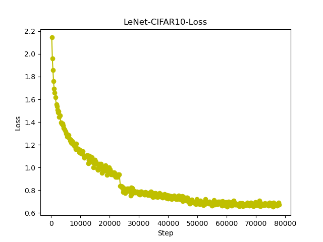
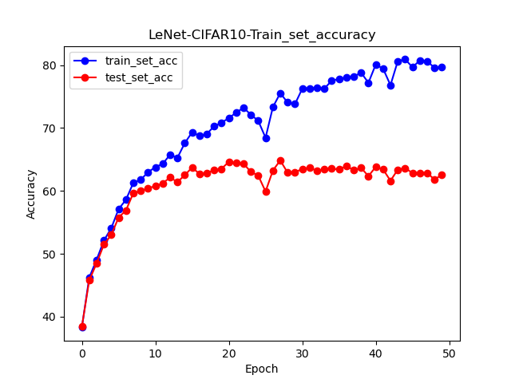

# LeNet-5

## Net Architectures


## Result
- ### FashionMNIST
    - Parameters
        ```
        Epoch = 50
        BatchSize = 32
        LearingRate = 0.001 
        ```
    - Result
        ```
        train_acc = 97.492%
         test_acc = 88.520%
        ```
    - Graph  
    
    


- ### CIFAR-10  
    Firstly, I want to say that `LeNet`'s performance on `CIFAR-10` is **NOT** really good. The highest accuracy I get is `63%`. By the way , some guys got 67% accuracy on their LeNet. 🤪
1. Exp1
    - Parameters
        ```
        Epoch = 50
        BatchSize = 32
        LearingRate = 0.001
        ```
    - Result
        ```
        train_acc = 81%
         test_acc = 59%
        ```
    - Graph   
    
      
      

    > Bad performance on test dataset. Maybe **overfitting**.  
    > There are some ways that could be used to improve the performance:
    >   1. Change param.  
    > eg. Let `Learning Rate` become `dynamic Learning Rate` ; Increase `Epoch` and ...  
    >   2. Improve our Net. eg. `Regularization` ; `Batch Normalization` and ...  
    >   
    > Going to show some results of these ways on next experiments.

2. Exp2  
    Change `Learning Rate` to `dynamic Learning Rate`.  
    - Parameters
        ```
        Epoch = 50
        BatchSize = 32
        LearingRate = 0.001   (Epoch<=15)
                    = 0.0002  (15<Epoch<=30)
                    = 0.00004 (30<Epoch<=40)
                    = 0.000008(40<Epoch<=50)
        ```
    - Result *(Better performence on test dataset, but lower train_acc)*
        ```
        train_acc = 76.462%
         test_acc = 63.250%
        ```
    - Graph   
    
    

    > It seems that `dynamic Learing Rate` accelerates the decline of `loss`, just like the pic shows (on about 23000th Steps, there is a sharp decline). 

3. Exp3  
    Change param such as `BatchSize` & `Epoch`.  
    In this case, I think more `Epoch` and bigger `BatchSize` are meaningless, but I still make a expriment about bigger `BatchSize`.
    - Parameters
        ```
        Epoch = 50
        BatchSize = 100
        LearingRate = 0.001
        ```
    - Result
        ```
        train_acc = 79.656%
         test_acc = 62.580%
        ```
    - Graph  
    
    


        
