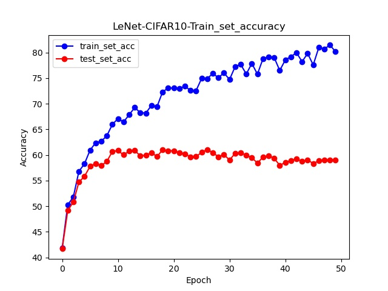
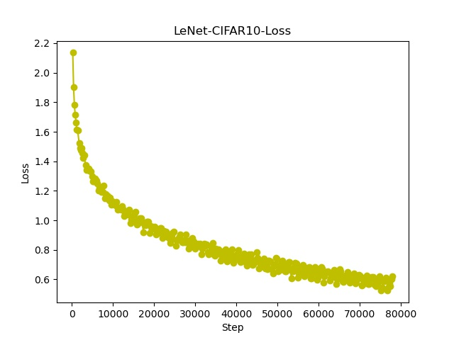

# LeNet-5

## Result
- ### FashionMNIST
    - Parameters
        ```
        Epoch = 20
        BatchSize = 32
        LearingRate = 0.001  (<10 Epoch)
                    = 0.0003 (>=10 Epoch)
        ```
    - Graph


- ### CIFAR-10
1. Exp1
    - Parameters
        ```
        Epoch = 50
        BatchSize = 32
        LearingRate = 0.001
        ```
    - Graph  
    1. Accuracy of train dataset & test dataset.  
    

    2. Loss.  
      
      

    > Bad performance on test dataset. Maybe **overfitting**.  
    > Two ways to try to improve the performance:
    >   1. Change `Learning Rate` to `dynamic Learning Rate`. & Increase `Epoch`.  
    >   2. Improve our LeNet-5. eg. `Regularization` & `Batch Normalization`.
    > Going to show results of these ways on Exp2 and Exp3.


        
